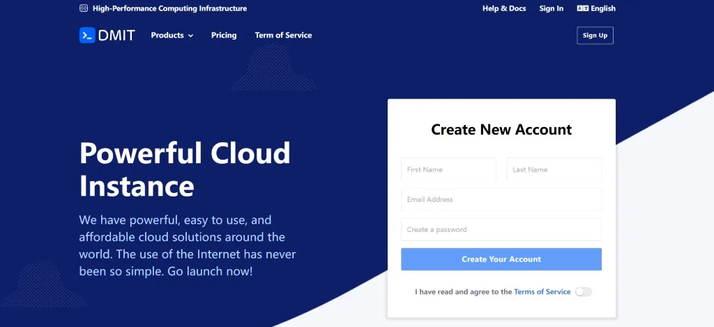

# DMIT VPS：CN2 GIA 优质线路，让你的海外服务器不再卡顿

如果你正在找一个靠谱的海外 VPS，但又不想踩坑——比如买了之后发现晚上根本连不上，或者用着用着就卡得要死——那 DMIT 可能就是你要找的那个。

这家从 2017 年开始做的服务商，主打的就是 CN2 GIA、CMIN2 这些优质线路，用的是 AMD EPYC 高端处理器，而且承诺不超售。简单说就是：给你的资源是实打实的，不会因为其他人占用导致你的 VPS 变慢。价格确实比那些几美元一个月的便宜货贵一些，但用过你就知道差别在哪了。

---

## 先说说 DMIT 是谁

DMIT 是 2017 年在美国纽约注册的公司，虽然注册在美国，但他们从一开始就很关注亚洲市场，特别是中国用户的需求。2019 年还收购了 HKServerSolutions，现在在香港、洛杉矶和东京都有数据中心。

技术上，所有 VPS 都是基于 KVM 虚拟化，硬件用的是 AMD EPYC 处理器（第二代或更新），搭配 DDR4 内存和 NVMe SSD。这配置在 VPS 行业里算是比较高端的了。

### 数据中心在哪

目前有三个主要位置：

- **美国洛杉矶**：离国内不算太远，延迟大概 140-160ms，价格相对便宜，带宽给得足
- **中国香港**：延迟最低，30-50ms 左右，体验最好但也最贵
- **日本东京**：亚洲另一个重要节点，介于两者之间

这三个位置基本覆盖了亚太地区的主要需求。如果你主要用户在国内，香港延迟最低；如果预算有限但要求不低，洛杉矶性价比更高。

### 怎么付款

对国内用户很友好：

- **支付宝**：实时到账，最方便
- **PayPal**：国际通用
- **信用卡**：支持 Visa、MasterCard

支持支付宝这点挺难得的，说明他们确实很重视中国市场。而且还有中文客服，遇到问题可以直接用中文沟通。

---

## DMIT 到底好在哪

### 线路是真的优质

DMIT 最大的亮点就是网络线路。他们提供 CN2 GIA、CMIN2、AS9929 等优化线路，这些线路相比普通国际线路在延迟和稳定性上都有明显优势。

具体说，CN2 GIA 是中国电信的精品网络，延迟低、稳定；CMIN2 是中国移动的国际专线，移动网络环境下表现出色；AS9929 是联通的优化线路。不管你是哪个运营商的用户，都能获得不错的访问体验。

很多人可能觉得"优化线路"听起来挺虚的，但实际用起来差别明显。普通线路晚上高峰期可能卡到怀疑人生，CN2 GIA 基本不会有这个问题。对于需要**稳定访问海外服务器或搭建面向国内用户的海外网站**的朋友来说，👉 [选择像 DMIT 这样的优质线路服务商](https://www.dmit.io/aff.php?aff=13832)，能省不少麻烦。

### 硬件配置扎实

全线使用 **AMD EPYC 处理器**，这是 AMD 的企业级处理器，性能比普通的 E3、E5 强很多。搭配 DDR4 内存和 NVMe SSD，整体性能确实不错。

这样的配置对需要高计算性能的应用特别有用——比如网站访问量大、需要处理大量数据或者运行对 CPU 要求高的程序。虽然成本更高，但用户体验确实有明显提升。

### 换 IP 不用肉疼

IP 被墙是很多人的痛点。DMIT 提供每 15 天免费更换一次 IP 的服务，其他时候如果需要换 IP，费用是 5 美元一次。相比其他服务商动辄 8-10 美元的换 IP 费用要便宜不少。

万一遇到 IP 不能正常使用的情况，不用担心额外的高昂费用，也不用重新购买 VPS，直接换个 IP 就能解决问题。

### 稳定性有保障

DMIT 提供 99% SLA 的可用性保障，而且从用户反馈来看，他们确实能做到。服务器稳定性表现不错，很少出现长时间宕机的情况。

即使遇到机房断电这样的意外情况，DMIT 也会提供相应的补偿。这种负责任的态度在小服务商中比较少见。

### 真的不超售

DMIT 承诺不超售，这在 VPS 行业里很难得。很多便宜的 VPS 服务商为了降低成本，会在一台物理服务器上开出远超其实际承载能力的 VPS 数量，导致用户使用过程中经常遇到性能不稳定的问题。

DMIT 的不超售政策意味着你购买的资源是真实可用的，不会因为其他用户的高负载而影响到你的 VPS 性能。对于有稳定性要求的用户来说非常重要。

### 产品线选择灵活

DMIT 的产品线设计很合理，既有便宜的普通 VPS，也有优化线路的高端 VPS。Tier 1 系列是普通国际线路，价格相对便宜；Premium 和 Eyeball 系列提供各种优化线路，价格高一些但性能和体验更好。

这样的设计让不同需求和预算的用户都能找到合适的选择。只是想要一个稳定的海外 VPS？选 Tier 1 系列就够了。对网络质量有更高要求？那 Premium 系列会是更好的选择。

---

## 主要套餐长什么样

DMIT 的套餐分类比较清晰，主要按照数据中心位置和线路类型来区分。Premium 系列是主打的优化线路套餐，提供 CN2 GIA 等高端线路，虽然价格相对较高，但网络质量确实出色。

### 香港 Premium 系列

从价格对比可以明显看出，香港的套餐比洛杉矶贵了不少，这主要是因为香港的机房成本和带宽成本都比较高。但香港的优势在于延迟更低，对于国内用户来说访问速度会更快。

洛杉矶的套餐性价比相对更高，特别是带宽给得很充足，适合对流量需求比较大的用户。

值得一提的是，这些 Premium 系列套餐都包含 CN2 GIA 优化线路，而且支持自定义升级 RAM 和 NVMe SSD 配置，提供了更多灵活性。所有套餐都包含 1 个 IPv4 地址和 1 个 IPv6 / 64 地址，以及标准的 DDoS 防护。

除了 Premium 系列，DMIT 还有 Eyeball 系列、Tier 1 系列等不同档次的产品线。如果预算有限或者对线路没有特殊要求，对于大部分个人用户或者小型项目来说，入门级的 TINY 套餐通常就够用了。

---

## 什么人适合用 DMIT

### 对网络质量有要求的

如果你经常需要访问国外网站，或者对网络延迟和稳定性比较敏感，DMIT 会是个不错的选择。特别是经常遇到网络卡顿、掉线等问题的朋友，CN2 GIA 线路能够明显改善这些体验。

很多用户反馈，在更换到 DMIT 之后，网络质量有了明显提升。虽然价格相对更高一些，但如果把时间成本和潜在损失考虑在内，其实还是划算的。毕竟，网络不稳定带来的工作中断或访问失败，造成的损失往往远远超过那点额外的费用。

### 商业用途和生产环境

如果你需要用 VPS 来搭建网站、做生意或者运行重要的应用，DMIT 的稳定性和不超售政策会给你更多保障。特别是对于电商网站、在线服务或者需要 7×24 小时稳定运行的应用来说，DMIT 的可靠性值得信赖。

商业用途最怕的就是服务不稳定导致的损失。DMIT 虽然价格高一些，但 99% SLA 保障和高性能硬件配置，能够最大程度避免因为服务器问题导致的业务中断。而且他们的技术支持响应也比较及时，遇到问题能够快速解决。

### 预算充足且追求性能的

说实话，DMIT 的 Premium 系列确实不便宜，特别是香港的套餐。如果你预算比较充足，并且希望获得更好的使用体验，那么 DMIT 会是一个很好的选择。

对于一些对性能要求比较高的应用，比如需要处理大量数据、运行复杂程序或者对响应速度有严格要求的场景，DMIT 的硬件优势会更加明显。虽然花钱多一些，但能够节省很多时间和精力。

### 需要多地区部署的

DMIT 在香港、洛杉矶和东京都有数据中心，如果你需要在多个地区部署服务，或者想要测试不同地区的网络效果，DMIT 提供了不错的选择。而且各个数据中心的硬件配置和服务水平都比较一致，管理起来会比较方便。

特别是对于需要服务亚太地区用户的业务来说，这三个位置的覆盖还是很有针对性的。你可以根据用户分布情况选择合适的数据中心，或者采用多点部署的策略来提升服务质量。

---

## 常见问题

**CN2 GIA 和普通线路差别大吗？**

CN2 GIA 是中国电信的精品网络，相比普通的 163 骨干网有更好的网络质量。具体表现在延迟更低、丢包率更少、晚高峰时段不容易拥堵。如果你经常在网络繁忙时段使用 VPS，会明显感觉到 CN2 GIA 的优势。

普通线路虽然便宜一些，但在网络高峰期可能会出现速度变慢的情况。如果你对网络质量要求不高，或者主要在非高峰时段使用，普通线路也够用。但如果是商业用途或者对稳定性要求较高，建议选择 CN2 GIA 线路。

**IP 被墙了怎么办？**

DMIT 提供每 15 天免费更换一次 IP 的服务，已经比那些必须付费才能更换 IP 的商家好太多了。如果你的 IP 被墙了，可以在用户后台提交工单申请更换，通常会在几个小时内处理完成。

如果不到 15 天又需要换 IP，费用是 5 美元一次，相比其他服务商要便宜一些。建议购买套餐时选择季付或年付，这样才能享受免费换 IP 的服务。

**可以退款吗？**

DMIT 提供有限的退款政策：购买后 3 天内且使用流量不超过 30GB 可以申请全额退款，30 天内可以申请剩余价值退款。不过具体的退款条件可能会有变化，建议在购买前仔细阅读他们的服务条款。

如果你不确定 DMIT 是否适合自己，建议先购买最便宜的套餐试用一下，测试网络效果和服务质量。

**香港和洛杉矶机房怎么选？**

这主要看你的需求和预算。香港机房的优势是延迟更低，通常在 30-50ms 左右，网络体验会更好，但价格也更贵。洛杉矶机房延迟稍高一些，大概在 140-160ms，但性价比更好，而且带宽给得更充足。

如果你对延迟很敏感，比如需要实时操作或者对响应速度要求很高，建议选择香港机房。如果主要是搭建网站或者做一些对延迟不太敏感的应用，洛杉矶机房会更划算。

**适合搭建网站吗？**

DMIT 很适合搭建面向国内用户的网站，特别是使用 CN2 GIA 线路的套餐。由于线路优化好，国内用户访问速度会比较快，而且稳定性也不错。很多用户反馈用 DMIT 搭建的网站打开速度很满意。

不过需要注意的是，如果你的网站主要面向海外用户，DMIT 的优势就不那么明显了。另外，搭建网站还需要考虑备案问题，由于 DMIT 是海外服务器，不需要备案，但也意味着网站内容需要符合相关法规要求。

**经常缺货吗？什么时候补货？**

DMIT 的热门套餐确实经常缺货，特别是香港的 Premium 系列和洛杉矶的低价套餐。这主要是因为他们不超售，而且产品确实比较受欢迎，所以库存经常不够。

补货时间不太固定，通常会在官网公告或者社交媒体上通知。建议关注他们的官方动态，或者加入相关的 VPS 交流群获取补货消息。如果看到有库存的合适套餐，建议不要犹豫太久，因为可能很快就会售完。

---

通过这篇文章，你应该对 DMIT 有了比较全面的了解。总的来说，DMIT 确实是一家值得考虑的高端 VPS 提供商，特别是在网络线路优化和硬件配置方面有着明显的优势。

虽然价格要贵一些，但如果你对网络质量有较高要求，或者需要用 VPS 来做一些重要的业务，那么 DMIT 会是一个不错的选择。他们的 CN2 GIA 等优质线路、AMD EPYC 高性能处理器、免费换 IP 服务和 99% SLA 保障，对于国内用户来说确实很实用。对于追求**稳定性高、网络质量好的海外 VPS 服务**的朋友，👉 [不妨到 DMIT 看看他们的最新套餐](https://www.dmit.io/aff.php?aff=13832)，根据自己的具体需求选择合适的配置。

当然，如果你只是想要一个便宜的 VPS 来学习或者做简单项目，也可以选择 Tier 1 系列，年付仅需 36 美元。
